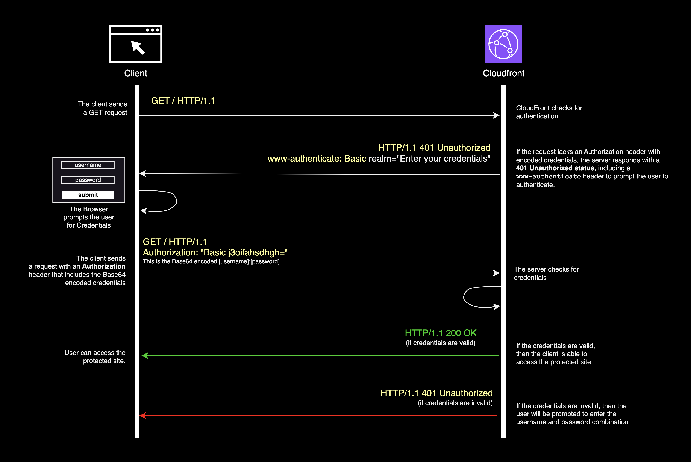
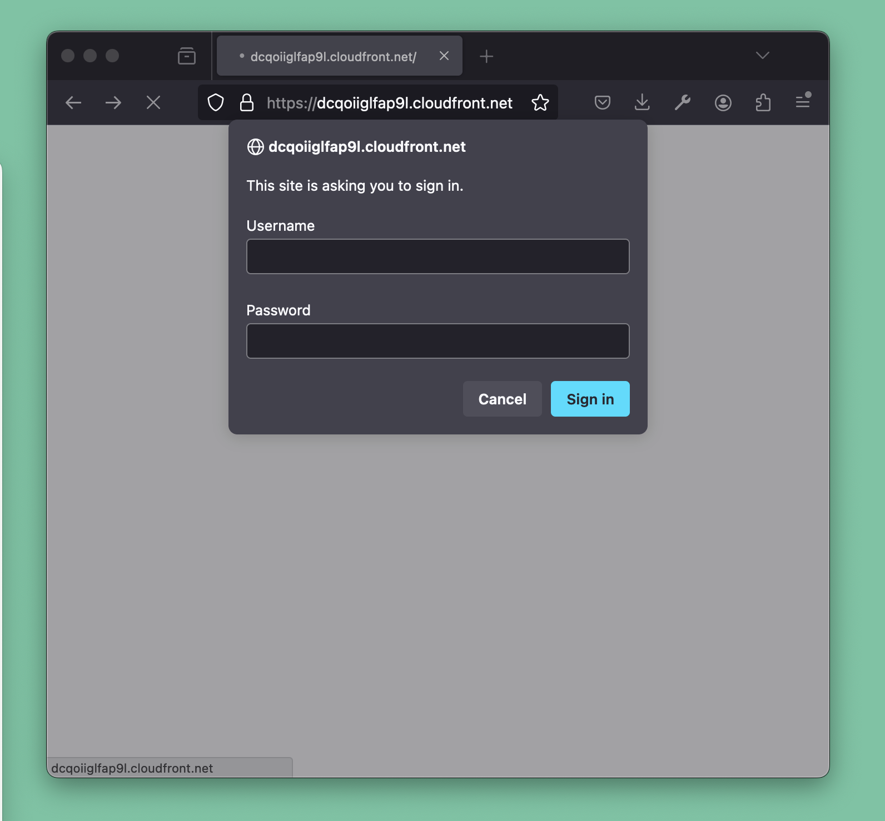
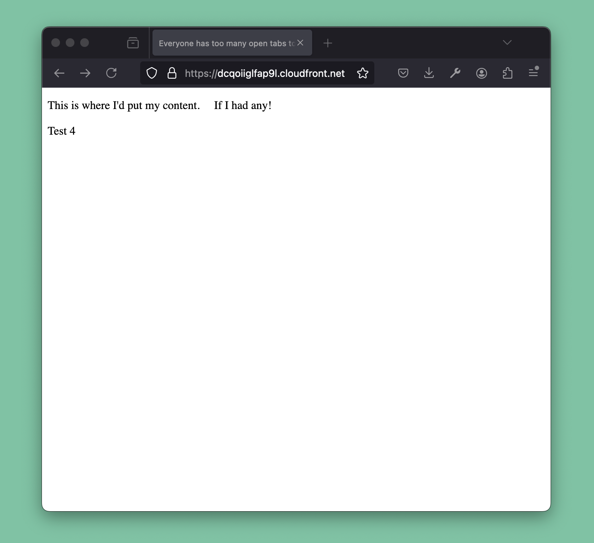
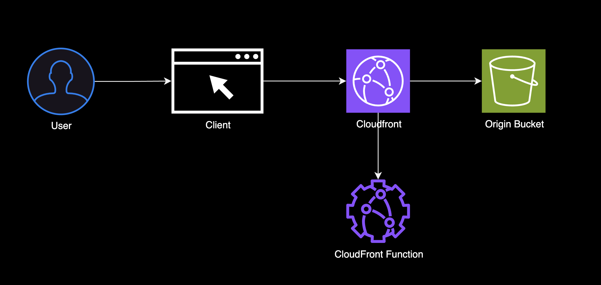
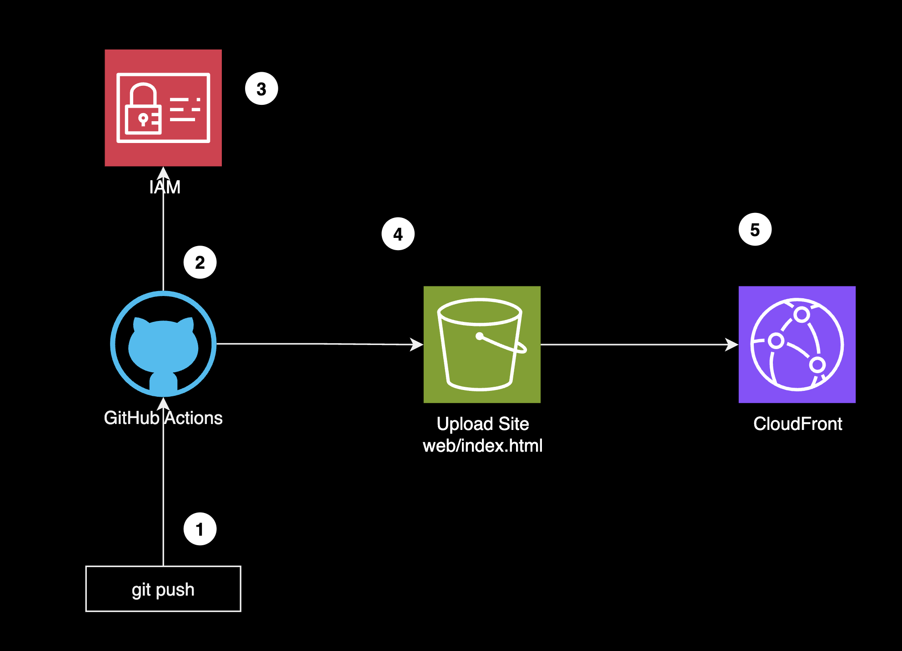
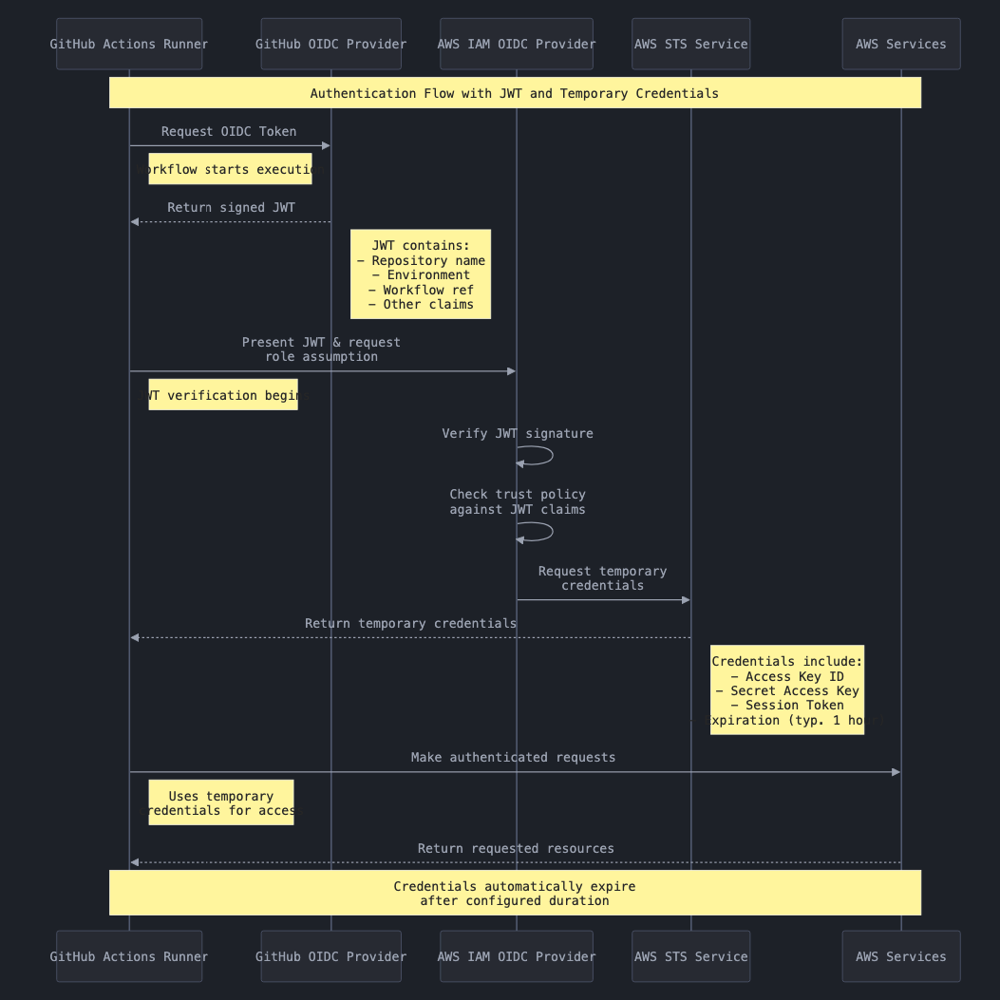

# Last Call Media Cloud Deployment Challenge Notes

In this README I will outline my solution to the Last Call Media Cloud Deployment Challenge. 


### Solution URL and Credentials
- **You can find the my solution at**: https://dcqoiiglfap9l.cloudfront.net/ 
    - I tested it with Firefox and Chrome *private browsing mode*.
- **Credentials**: 
    - `username`: `user`
    - `password`: `pass`

### Pre-requisites
You need to have the following tools installed: 
- AWS CLI installed and configured.
- AWS CDK installed and bootstrapped.
- GitHub CLI installed and configured for your Github account.

### Deploying the solution

To deploy the solution, run the following commands:

```bash
npm run deploy
```

## Introduction

I enjoyed exploring this problem space. Initially, the challenge felt a bit ambiguous, but after digging into the provided resources, it became clear that the solution involved three main components: **Basic HTTP Authentication**, **Website Hosting**, and **CI/CD Automation**.


### Understanding HTTP Basic Authentication



HTTP Basic authentication is a native HTTP scheme, defined in [RFC 7617](https://datatracker.ietf.org/doc/html/rfc7617), that provides a simple way to verify users by prompting them to enter a username and password for access to specific content. The process typically follows this flow:

1. **Initial Request**: The client initiates a request to access protected content by sending an HTTP GET request. If the request lacks an Authorization header, CloudFront (or the server) detects this and denies access.

2. **401 Unauthorized Response**: The server responds with a 401 Unauthorized status, along with a www-authenticate header. This header includes Basic realm="Enter your credentials", prompting the client to provide credentials.

3. **Credentials Prompt**: The browser, upon receiving the 401 response with the www-authenticate header, prompts the user to enter a username and password.

4. **Authorization Header with Credentials**: After the user submits their credentials, the client constructs a new request with an Authorization header. This header contains the word "Basic" followed by a space and the base64-encoded string of the format username:password.

5. **Verification by CloudFront**: The server (in this case, CloudFront) receives the request with the Authorization header and decodes the base64-encoded credentials. It verifies if the credentials are valid.

6. **Access Granted or Denied**:

- If the credentials are valid, the server responds with `HTTP/1.1 200 OK`, granting the client access to the protected content.
- If the credentials are invalid, the server responds with another `401 Unauthorized` status, prompting the client to re-enter the correct credentials.


### Implementing HTTP Basic Authentication

I used a CloudFront function to handle HTTP Basic Authentication because it's more cost-effective than Lambda@Edge (about 1/6 the cost). The CloudFront function checks the credentials and forwards the request if valid or responds with 401 Unauthorized if invalid.

### The Authentication CloudFront Function

The authentication script is a CloudFront function that implements the HTTP Basic Authentication scheme. It is used to verify the user's credentials and grant access to the protected content. If the user's credentials are valid, the request is forwarded to the origin (in this case, the S3 bucket that hosts the website). If the credentials are invalid, the script responds with a `401 Unauthorized` status and a `www-authenticate` header, prompting the user to enter the correct credentials.

```js
function btoa(input) {
    var b64 = "ABCDEFGHIJKLMNOPQRSTUVWXYZabcdefghijklmnopqrstuvwxyz0123456789+/=";
    input = String(input);
    var bitmap, a, b, c,
        result = "", i = 0,
        rest = input.length % 3;

    for (; i < input.length;) {
        if ((a = input.charCodeAt(i++)) > 255
                || (b = input.charCodeAt(i++)) > 255
                || (c = input.charCodeAt(i++)) > 255)
            throw new TypeError("Failed to execute 'btoa' on 'Window': The string to be encoded contains characters outside of the Latin1 range.");

        bitmap = (a << 16) | (b << 8) | c;
        result += b64.charAt(bitmap >> 18 & 63) + b64.charAt(bitmap >> 12 & 63)
                + b64.charAt(bitmap >> 6 & 63) + b64.charAt(bitmap & 63);
    }

    return rest ? result.slice(0, rest - 3) + "===".substring(rest) : result;
}
```
I reused the `btoa` function provided by the challenge to encode the username and password in base64.

> It's important to note that base64 encoding is not encryption. Therefore, this method should only be used over HTTPS to prevent credentials from being exposed during transmission.

```js
function handler(event) {
    var authHeaders = event.request.headers.authorization;
    var username = 'user';
    var password = 'pass';

    var expected = 'Basic ' + btoa(`${username}:${password}`);
    if (authHeaders && authHeaders.value === expected) {
      return event.request;
    }
  
    var response = {
      statusCode: 401,
      statusDescription: "Unauthorized",
      headers: {
        "www-authenticate": {
          value: 'Basic realm="Enter your credentials"',
        },
      },
    };
  
    return response;
  }
```
The handler function is the entry point for the CloudFront function. It receives the request, verifies the user's credentials, and either grants access to the protected content in the origin S3 bucket or prompts the user to enter the correct credentials by sending a `401 Unauthorized` response with a `www-authenticate` header.

```js
var response = {
    statusCode: 401,
    statusDescription: "Unauthorized",
    headers: {
        "www-authenticate": {
            value: 'Basic realm="Enter your credentials"',
        },
    },
};

return response;
```

### Basic Authentication Screenshots
Here are some screenshots of the basic authentication in action:






## Website Hosting 



The website hosting part of the challenge involved creating a **CloudFront distribution** that serves the website files in an **S3 bucket**. 

### S3 Bucket
An S3 bucket can store static files, like HTML, CSS, JavaScript, and images, that make up a website. It's highly durable, secure, and can be configured to serve content directly to the internet. Hosting a static site on S3 is cost-effective because you only pay for storage and data transfer, with no server management needed.

### CloudFront Distribution
CloudFront is AWS's content delivery network (CDN) service. It caches content in edge locations worldwide, which improves load times and reduces latency for users regardless of their location. Using CloudFront with S3 can significantly enhance performance at a low cost, and includes free HTTPS for secure connections.

#### Origin Access Identity (OAI)
OAI allows CloudFront to access an S3 bucket securely without exposing the bucket to the public internet. By setting up an OAI, you restrict direct access to your S3 bucket and serve the content exclusively through CloudFront, adding a layer of security without additional cost.

### S3 Bucket Deployment
S3 Bucket Deployment, automates the process of uploading files in your S3 bucket. It simplifies the deployment process, after the infrastructure is deployed.


## CI/CD Automation

For the CI/CD part of the challenge, I created a GitHub Actions workflow that automates the deployment of the website to the S3 bucket when there are changes in the `main` branch. The workflow is triggered by a push to the `main` or `sergio-pichardo-cloud-deploymnt-challenge` branch.

### GitHub Actions Workflow


This is a process for automatically deploying a website to AWS when code is pushed to GitHub. It uses GitHub Actions, AWS IAM OIDC Provider, S3, and CloudFront to securely and efficiently update and serve the site.

### Steps:

1. **Push Code to GitHub**
   - Code changes are pushed to GitHub, triggering a GitHub Actions workflow to deploy the website.

2. **Start GitHub Actions Workflow**
   - GitHub Actions initiates the workflow, but needs secure access to AWS resources, which we grant using a method called OIDC (OpenID Connect) instead of storing AWS credentials via GitHub secrets.

3. **AWS IAM Authentication**
   - AWS IAM verifies GitHub’s identity using OIDC and provides temporary credentials, allowing GitHub Actions to access AWS resources securely.

4. **Upload Site to S3**
   - GitHub Actions uses the temporary credentials to upload the website files (e.g., `index.html`) to an S3 bucket, which hosts the static website.

5. **Serve Content via CloudFront**
   - CloudFront, AWS’s content delivery network, uses the S3 bucket as its origin to serve the website files. It caches these files in multiple locations worldwide, providing faster load times for users globally.


### Understanding the GitHub OIDC Provider



GitHub proves its identity to AWS using a signed token to assume a specific IAM role, and AWS gives back temporary credentials for that role that GitHub (as the web principal) can assume to access AWS services.


### Helper Scripts 

Created a few helper scripts to streamline the deployment process:

- `delete-github-secrets.sh`: Deletes the GitHub secrets before generating new ones.
- `create-github-secrets.sh`: Creates the GitHub secrets needed for the GitHub Actions workflow.
- `generate-envars.sh`: Generates the environment variables from the `aws-cdk-outputs.json` file.

## Meeting Requirements 
1. Maintainability

I focused on making the solution easy to understand, modify, and reuse. Each stack is organized in its own file, named after the feature it implements, and operates like a "black box." You simply pass in the required parameters, and the stack handles the rest.

To ensure easy deployment in any AWS account and adaptability for any GitHub repository, I chose AWS CDK for infrastructure as code and GitHub Actions for CI/CD. Using CDK allows anyone to replicate the setup by running CDK commands in their AWS environment, and the GitHub Actions workflow is straightforward to configure for any repository.
    
2. Automation

I wanted the deployment process to be fully automated, so I set up a GitHub Actions workflow that triggers on any change to the main branch. The workflow detects changes, builds the site, and deploys it to S3, all without manual steps. It also automates the creation of GitHub secrets needed for deployment and handles CloudFront cache invalidation to ensure the latest content is always served.

3. Security 

I set up an Origin Access Identity (OAI) for the S3 bucket, so only CloudFront can access the content, keeping the bucket private.

Using an OIDC provider creates a trust relationship between GitHub and AWS, allowing GitHub to assume an IAM role in AWS without needing AWS credentials stored in the GitHub repository. This keeps the solution more secure.

Finally, CloudFront redirects HTTP to HTTPS, which is especially important when using HTTP Basic Authentication since it transmits data in base64 encoding rather than encrypting it.

4. Inexpensive

Cost efficiency was key in my decisions. CloudFront functions are significantly cheaper than Lambda@Edge, making them ideal for basic authentication tasks. Hosting the static site on S3 is also very affordable, with costs based only on storage and data transfer, and no need to manage servers.

CloudFront caches the site content globally, reducing the load on S3 and saving on data transfer costs. Altogether, this setup keeps expenses low while still providing a secure and reliable solution.

